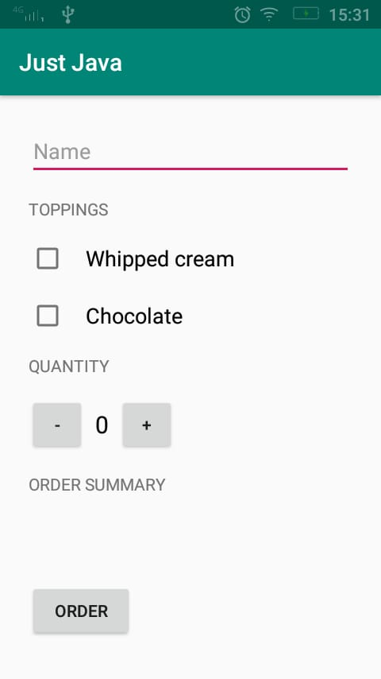
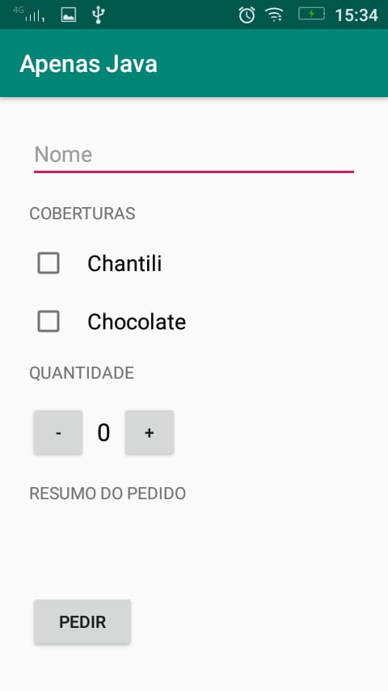

```txt

Udacity - Android Basics: User Input

Project Just Java

minSdkVersion=16
compileSdkVersion=28

What I am learn:
    - Get resources at runtime
    - Translate app (xml e runtime text). Indeed default idiom is English, so unless your
        target users is English language is required minimum two languages support.
    - Check box input
    - Text input
    - Button input
```



## Internationalization
En (Default)


----

Pt (Portuguese)



